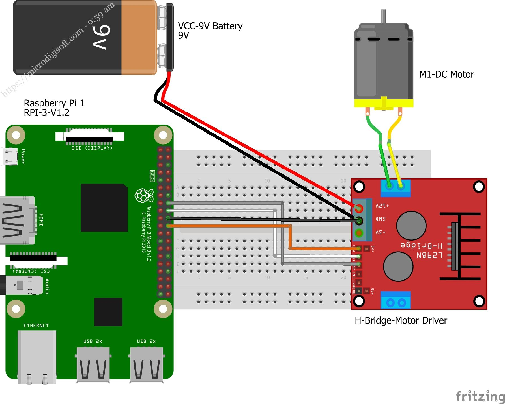

# robot-ros v0.1
Repository con il codice per la creazione di un robot tramite framework ROS

## Componenti
Questo robot utilizza i seguenti componenti hardware:
- Sensori (senza encoder)
- Raspberry Pi 4 con batteria PiSugar ([link al prodotto](https://www.amazon.it/gp/product/B09QRPNDHB/ref=ppx_yo_dt_b_search_asin_title?ie=UTF8&psc=1))
- Motor driver L298

## Istruzioni per l'avvio
Per avviare il robot su Raspberry Pi, eseguire i seguenti comandi:

```console
ros2 launch robot_ros launch_robot.launch.py
ros2 launch nav2_bringup navigation_launch.py use_sim_time:=False
ros2 launch slam_toolbox online_async_launch.py use_sim_time:=False
```

Per visualizzare l'albero dei frames:

```console
ros2 run tf2_tools view_frames
```

## Collegamenti
Di seguito i link a due immagini per il collegamento dei cavi:
- 
- 

| Rsp Pi 4  | L298
|-----------|-----------|
| GPIO25    | ENA    |
| GPIO24    | IN1    |
| GPIO23    | IN2    |
| GPIO14    | IN3    |
| GPIO14    | IN3    |
| GPIO13    | IN4    |
| GPIO15    | ENB    |

## Next Step
Le future evoluzioni del progetto prevedono:
- Aggiunta di motor encoder per un controllo più preciso
- Integrazione di un sensore LIDAR per la navigazione
- Utilizzo di un motor controller separato basato su Teensy 3.1/3.2 o ESP32
